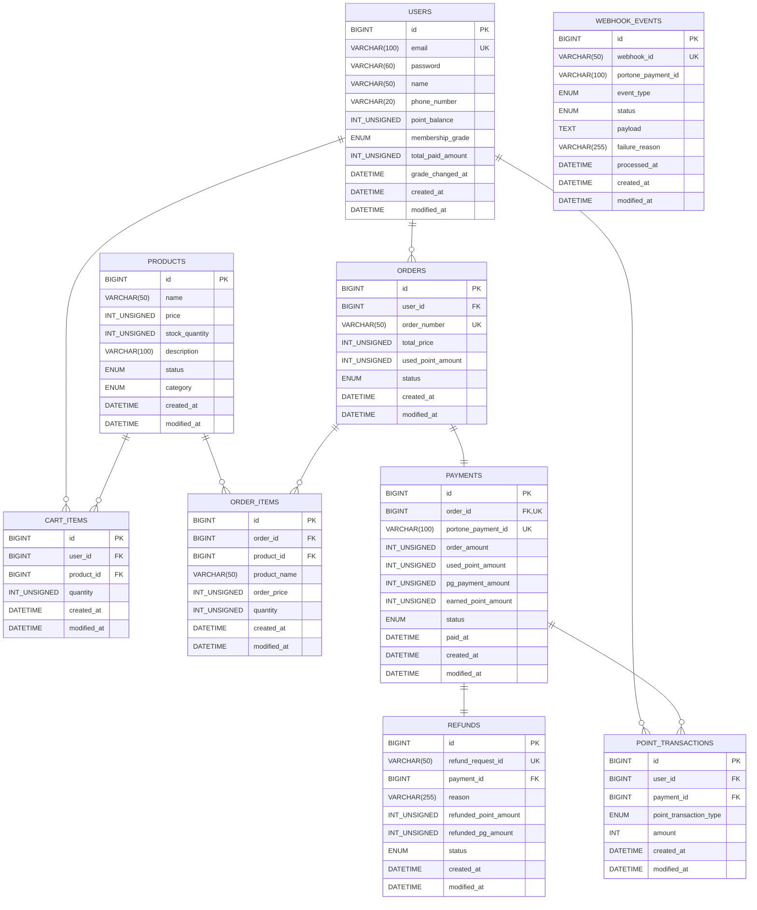

# 커머스 결제 시스템

PortOne PG 연동 기반의 커머스 결제 플랫폼입니다.
상품 조회부터 장바구니, 주문, 결제 확정, 환불, 포인트, 멤버십 등급까지 커머스 핵심 결제 흐름 전반을 구현합니다.

<br>

## 팀원 소개

| 이름 | 역할 | MBTI | 블로그 | GitHub | 담당 파트 |
|------|------|------|--------|--------|-----------|
| 라예실 | 리더 (일정 지연 시 인지) | INFP | [Velog](https://velog.io/@shil031120/posts) | [@sirisiyesiri](https://github.com/sirisiyesiri) | 결제 · 환불 · 공통 응답/예외 |
| 정욱재 | 부리더 (회의록/SA 문서/README 관리 · 시연 영상 제작) | INTP | [Velog](https://velog.io/@wookjaes/posts) | [@WookJaes](https://github.com/WookJaes) | 포인트 · 멤버십 · 웹훅 |
| 최준영 | 팀원 | INFJ | [Blog](https://blog.naver.com/pro16_) | [@ChoiT815](https://github.com/ChoiT815) | 인증/인가 · 배포 |
| 한다빈 | 팀원 (발표 리허설 주도 · 발표 PPT) | ISTP | [Velog](https://velog.io/@gksekqls21/posts) | [@HAN-DABON](https://github.com/HAN-DABON) | 상품 · 장바구니 · 주문 |

<br>

## 기술 스택

| 구분 | 기술 |
|------|------|
| Language | Java 17 |
| Framework | Spring Boot 4.0.6 |
| ORM | Spring Data JPA / Hibernate |
| Security | Spring Security, JWT (jjwt 0.12.6) |
| Database | MySQL |
| PG 연동 | PortOne Server SDK 0.23.0 |
| 인프라 | Docker, AWS (Amazon Corretto 17) |
| 모니터링 | Spring Boot Actuator |
| 테스트 | JUnit 5, H2 |

<br>

## 시스템 아키텍처

```
클라이언트
    │
    ▼
Controller (HTTP 요청 수신 / 응답 반환)
    │
    ▼
Facade (도메인 간 오케스트레이션 / 트랜잭션 경계 조율)
    │
    ├── Service (단일 도메인 비즈니스 로직)
    ├── CommandService (상태 변경 트랜잭션 묶음)
    │
    ▼
Repository (JPA / Spring Data)
    │
    ▼
MySQL
```

- **Facade 패턴** : 결제 확정·환불 등 여러 도메인(결제·포인트·주문·재고)을 조율해야 하는 흐름을 Facade가 담당합니다.
- **Port & Adapter 패턴** : PG 호출부를 `PaymentGateway` 인터페이스로 추상화하여 PortOne 의존성을 도메인 로직에서 분리합니다.
- **도메인 중심 패키지 구조** : `domain/{기능}/` 단위로 controller, service, repository, entity, dto를 응집합니다.

<br>

## 주요 기능

### 인증
- 이메일/비밀번호 회원가입·로그인
- JWT 발급 및 Spring Security Filter 기반 인증

### 상품
- 카테고리·이름·가격 기반 검색 및 정렬
- 페이지네이션 지원

### 장바구니
- 상품 담기 / 수량 변경 / 단건·전체 삭제
- 장바구니에서 바로 주문 생성

### 주문
- 주문 미리보기 (포인트 적용 금액 사전 확인)
- 비관적 락(Pessimistic Lock)으로 동시 주문 시 재고 초과 방지
- InnoDB lock wait timeout 3초 설정
- 주문 목록 / 단건 조회 / 주문 취소

### 결제 (PortOne 연동)
- **3가지 결제 타입** : 카드 단독(`CARD_ONLY`) / 포인트 단독(`POINT_ONLY`) / 카드+포인트 혼합(`CARD_POINT`)
- 포인트 전액 결제는 PG 호출 없이 서버 내부에서 즉시 처리
- PortOne API 재조회로 클라이언트가 보낸 결제 결과를 신뢰하지 않음
- 금액 불일치 시 자동 보상 취소(PG 취소 → 내부 실패 처리)

### 웹훅
- PortOne 웹훅 서명 검증
- webhookId 기준 중복 수신 방지 (멱등성 보장)
- `PAID` / `CANCELLED` 이벤트 처리 및 내부 상태 동기화

### 환불
- 결제 완료 주문 전액 환불
- DB 상태 변경 후 PG 취소 API 호출 (PG 실패 시 환불 이력을 FAIL 상태로 기록)
- 환불 목록 / 단건 조회

### 포인트
- 결제 완료 시 멤버십 등급 기준 포인트 자동 적립
- 환불 시 사용 포인트 복구 + 적립 포인트 회수
- 포인트 거래 내역 조회

### 멤버십 등급
| 등급 | 최소 누적 결제 금액 | 포인트 적립률 |
|------|---------------------|---------------|
| NORMAL | 0원 ~ | 1% |
| VIP | 50,000원 ~ | 5% |
| VVIP | 100,000원 ~ | 10% |

결제 완료·환불 시 누적 결제 금액이 자동 갱신되며 등급이 실시간으로 재계산됩니다.

<br>

## 결제 상태 흐름

```
PENDING ──→ COMPLETED ──→ REFUND
    │
    └──→ FAILED
```

## 주문 상태 흐름

```
PAYMENT_PENDING ──→ ORDER_COMPLETED
       │
       └──→ ORDER_CANCELED
```

<br>

## API 명세

> 인증이 필요한 API는 `Authorization: Bearer {token}` 헤더가 필요합니다.

### 인증
| Method | URI | 설명 | 인증 |
|--------|-----|------|------|
| POST | `/api/auth/signup` | 회원가입 | ✗ |
| POST | `/api/auth/login` | 로그인 (JWT 발급) | ✗ |

### 상품
| Method | URI | 설명 | 인증 |
|--------|-----|------|------|
| GET | `/api/products` | 상품 목록 조회 (검색·정렬·페이지네이션) | ✗ |
| GET | `/api/products/{productId}` | 상품 단건 조회 | ✗ |

### 장바구니
| Method | URI | 설명 | 인증 |
|--------|-----|------|------|
| POST | `/api/carts/items` | 장바구니 상품 추가 | ✓ |
| GET | `/api/carts` | 장바구니 목록 조회 | ✓ |
| PUT | `/api/carts/items/{cartItemId}` | 장바구니 수량 변경 | ✓ |
| DELETE | `/api/carts/items/{cartItemId}` | 장바구니 단건 삭제 | ✓ |
| DELETE | `/api/carts/items` | 장바구니 전체 삭제 | ✓ |
| POST | `/api/carts/orders` | 장바구니에서 주문 생성 | ✓ |

### 주문
| Method | URI | 설명 | 인증 |
|--------|-----|------|------|
| GET | `/api/orders/preview` | 주문 미리보기 | ✓ |
| GET | `/api/orders` | 주문 목록 조회 | ✓ |
| GET | `/api/orders/{orderId}` | 주문 단건 조회 | ✓ |
| POST | `/api/orders/{orderId}/cancel` | 주문 취소 | ✓ |

### 결제
| Method | URI | 설명 | 인증 |
|--------|-----|------|------|
| POST | `/api/payments/confirm` | 결제 확정 | ✓ |
| POST | `/api/payments/{paymentId}/refunds` | 결제 환불 | ✓ |

### 환불
| Method | URI | 설명 | 인증 |
|--------|-----|------|------|
| GET | `/api/refunds` | 환불 목록 조회 | ✓ |
| GET | `/api/refunds/{refundId}` | 환불 단건 조회 | ✓ |

### 포인트
| Method | URI | 설명 | 인증 |
|--------|-----|------|------|
| GET | `/api/users/me/points` | 포인트 잔액 조회 | ✓ |
| GET | `/api/users/me/points/transactions` | 포인트 거래 내역 조회 | ✓ |

### 회원
| Method | URI | 설명 | 인증 |
|--------|-----|------|------|
| GET | `/api/users/me` | 내 정보 조회 | ✓ |
| GET | `/api/users/me/memberships` | 멤버십 등급 조회 | ✓ |

### 웹훅
| Method | URI | 설명 |
|--------|-----|------|
| POST | `/api/webhooks/portone` | PortOne 웹훅 수신 |

<br>

## ERD



<br>

## 로컬 실행 방법

### 사전 요구사항
- Java 17
- MySQL 8.x

### 환경 변수 설정

`application-local.yaml` 또는 환경 변수로 아래 값을 설정합니다.

```yaml
spring:
  datasource:
    url: jdbc:mysql://localhost:3306/{DB명}
    username: {DB_USERNAME}
    password: {DB_PASSWORD}

jwt:
  secret: {JWT_SECRET_KEY}
  expiration: 3600000

portone:
  base-url: "https://api.portone.io"
  api-secret: {PORTONE_API_SECRET}
  store-id: {PORTONE_STORE_ID}
  channel-key: {PORTONE_CHANNEL_KEY}
  webhook-secret: {PORTONE_WEBHOOK_SECRET}
```

### 빌드 및 실행

```bash
# 빌드
./gradlew build

# 실행
./gradlew bootRun
```

### Docker 실행

```bash
# JAR 빌드
./gradlew build

# Docker 이미지 빌드
docker build -t commerce-payment-application .

# 컨테이너 실행
docker run -p 8080:8080 \
  -e PROD_DB_URL=jdbc:mysql://... \
  -e PROD_DB_USERNAME=... \
  -e PROD_DB_PASSWORD=... \
  -e PROD_JWT_SECRET=... \
  -e PROD_PORTONE_API_SECRET=... \
  -e PROD_PORTONE_STORE_ID=... \
  -e PROD_PORTONE_CHANNEL_KEY=... \
  -e PORTONE_WEBHOOK_SECRET=... \
  commerce-payment-application
```

<br>

## 프로젝트 구조

```
src/main/java/com/example/commercepaymentapplication/
├── domain/
│   ├── auth/           # 회원가입·로그인
│   ├── cart/           # 장바구니
│   ├── order/          # 주문
│   ├── payment/        # 결제 (Facade / Service / CommandService / Port)
│   ├── point/          # 포인트
│   ├── portone/        # PortOne 클라이언트 및 웹훅
│   ├── product/        # 상품
│   ├── refund/         # 환불
│   └── user/           # 회원 정보·멤버십
└── global/
    ├── config/         # Security, JPA Auditing, PortOne 설정
    ├── entity/         # BaseTimeEntity (createdAt, updatedAt)
    ├── error/          # 전역 예외 처리, ErrorCode
    ├── filter/         # JWT 인증 필터
    ├── jwt/            # JwtProvider
    └── response/       # 공통 응답 래퍼 (ApiResponse)
```

<br>

## 향후 개선 사항

- **선 재고 차감 정책 보완**
  현재는 주문 생성 시점에 재고를 먼저 차감하여 동시 주문 상황의 재고 초과 판매를 방지합니다. 다만 결제창 이탈 등으로 결제가 확정되지 않은 주문의 재고가 일시적으로 묶일 수 있으므로, 추후 스케줄러를 도입하여 일정 시간 이상 `PAYMENT_PENDING` 상태로 남아 있는 주문을 자동 만료 처리하고 재고를 복구할 예정입니다.

- **결제 확정 동시성 보완**
  결제 완료 처리는 클라이언트의 결제 확정 요청과 PortOne 웹훅 이벤트 양쪽에서 진입할 수 있습니다. 두 요청이 동시에 도착할 경우를 대비해 현재는 상태값 기반으로 중복 처리를 방어하고 있으며, 추후 결제 단위 락 또는 명확한 멱등 처리 구조를 적용하여 동시성 안정성을 강화할 예정입니다.

- **결제/환불 이력 조회 기능 고도화**
  현재는 주문 내역과 환불 내역을 기본 정보 중심으로 조회합니다. 추후 결제 수단, 사용 포인트, 적립 포인트, 환불 사유, 실패 사유 등을 더 상세히 제공하여 사용자가 결제 및 환불 흐름을 명확하게 확인할 수 있도록 개선할 예정입니다.

- **조회 성능 최적화 및 N+1 문제 개선**
  현재 주문, 결제, 환불 조회 과정에서 연관 엔티티를 함께 조회하는 구간이 늘어나고 있습니다. 추후 실제 쿼리 로그를 기반으로 N+1 발생 지점을 점검하고, `fetch join`, `EntityGraph`, DTO 직접 조회 등을 적용하여 조회 성능을 개선할 예정입니다.
